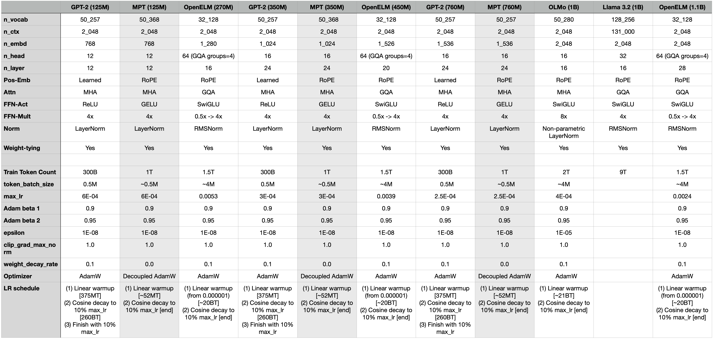

Repo where I'll be creating my own LLM from scratch. The goal is to deepen my understanding of model-architecture design, training methodologies, and core deep-learning principles.

Run first
`export PYTHONPATH="${PYTHONPATH}:$(pwd)/src"`

- Make sure to use PyTorch 2.0 or later!

To debug on a Mac, use: `./run_pre_training_e2e_on_mac.sh`
To run on a machine with an NVIDIA GPU(s), use: `./run_pre_training_e2e.sh`

Push to server with NVIDIA GPUs (ignoring contents from `temp_data/` dir):
```
rsync -avz --delete --progress --exclude 'temp_data/*' $PWD username@server_ip_address:/home/ubuntu/
```

# Choosing Model Architecture and Training Parameters
Due to my limited GPU resources (I don't want to spend resources searching for the best parameters), and because this is a learning project, I'll base my parameters around the parameters used by open source LLMs. It's not a perfect approach by any means, and choosing parameters can be an entire project of its own, but for now this is fine.  
Below are is a summary table I created to help me tune my parameters (more info in [parameters_tuning.ipynb](./notebooks/parameters_tuning.ipynb)).




More to come...


11/21/24 2:14PM
Time (per step) = 767.36 ms. 
Throughput: 341,620.04 tokens/sec
