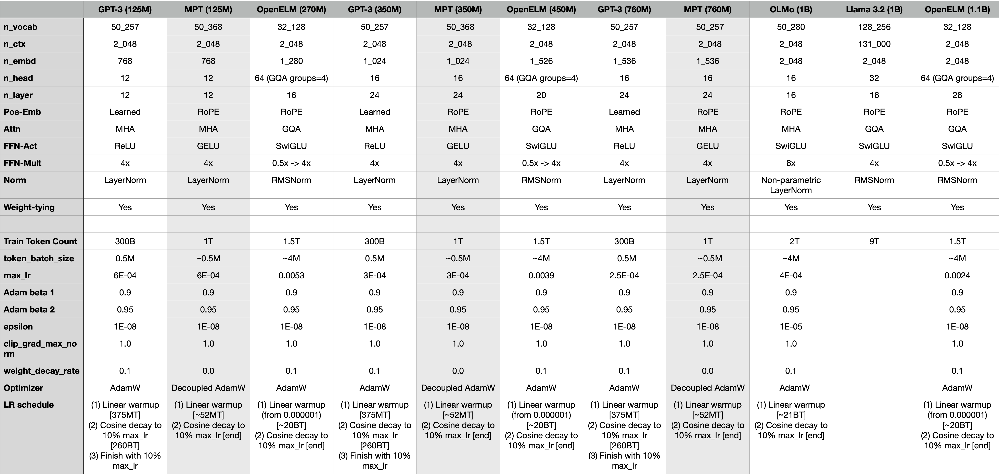

# LF_LLM-269M

MyLLM is a deep-learning personal project where I built a modern LLM from the ground up. I focused on developing the core components required for pre-training an LLM, including writing the model-architecture code, handling large datasets, training the model efficiently, and evaluating its performance.

# How To Reproduce
You can debug on a Mac (or most unix/linux-machine) by using `./run_pre_training_e2e_debug.sh`.   

To actually train the model I used NVIDIA GPUs (went with 8xA100s because of cost). To run training end-to-end (downloading all datasets needed, training, running evals, etc) you can simply run `./run_pre_training_e2e.sh`. I used [VESSL AI's](https://vessl.ai) Workspaces to setup my training infra, using their `PyTorch 2.3.1 (CUDA 12.1)` image.

Note that this project uses the ./temp_data/ dir as a quick access way to store temporary data, such as logs, datasets, and checkpoints. To avoid syncing this between a development machine and your accelerated machine you can use e.g. `rsync -avz --delete --progress --exclude 'temp_data/*' $PWD username@server_ip_address:/home/ubuntu/`

# Building LF_LLM-269M

### Choosing Model Architecture and Training Parameters
Due to my limited GPU resources (I don't want to spend resources searching for the best parameters), and because this is a learning project, I'll base my parameters around the parameters used by open source LLMs. It's not a perfect approach by any means, and choosing parameters can be an entire project of its own, but for now this is fine.  
Below are is a summary table I created to help me tune my parameters (more info in [parameters_tuning.ipynb](./notebooks/parameters_tuning.ipynb)).

### Pre-Training Data
For pre-training data I looked at [Dolma](https://allenai.org/dolma) and [RedPajama-v2](https://www.together.ai/blog/redpajama-data-v2), but [build-nanogpt](https://github.com/karpathy/build-nanogpt) showed me that a smaller, more refine dataset is enough for a small project like this.

# Results

[metric_graphs.ipynb](./notebooks/metric_graphs.ipynb)

**At step 0 (no training):**  
(Green is the prompt, blue is LLM generated text.)
- Sample 1: If animals could talk, my pet would probably say undertake undertake distortion intest Gylassotide acids Yankee neoconcept Coming Coming launcherimpl Sussex Sussexinea minim Ding
- Sample 2: HTML stands for campaigns desserts sawradio AUTH sort Pythononto unforeseen rainfall rainfall Host awaits solubleheaded Fever estimate genders proponentMAR
- Sample 3: The clever fox built the strange machine with just a feather, a pebble, and a tiny twig intrusion complying Resist master Yad induced derogatory Magic damageced amusing 290Sn},{" muddy universal prospect prospect prospect Rey

**After last training step:**  
(Green is the prompt, blue is LLM generated text.)
- Sample 1: If animals could talk, my pet would probably say hello or I would say Hi.
I am excited to have my pet respond to the sound I
- Sample 2: HTML stands for HyperText Markup Language. For more information about the browser, see:<|endoftext|>A few months ago
- Sample 3: The clever fox built the strange machine with just a feather, a pebble, and a tiny twig ; by the time it was ready, it was a great working machine. After watching him carefully,

<strong>Resources/References</strong>

- [Molomo (MolmoE)](https://huggingface.co/allenai/MolmoE-1B-0924)
- [apple/corenet](https://github.com/apple/corenet/tree/main)
- [allenai/OLMo](https://github.com/allenai/OLMo)
- [mosaicml/llm-foundry](https://github.com/mosaicml/llm-foundry)
- [google-research/tuning_playbook](https://github.com/google-research/tuning_playbook)
- [karpathy/build-nanogpt](https://github.com/karpathy/build-nanogpt/tree/master)

## License
GNU GPLv3 ([LICENSE.txt](./LICENSE.txt))
